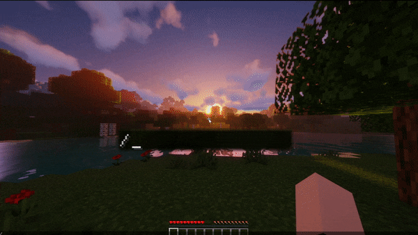

# SpentTime

### Information
This is a plugin that allows you to check how much time a player has spent on the server.
* **Performance-focused** - Minimizes the impact on server resources, allowing you to maintain high server performance.
* **Simplicity of configuration** - Thanks to clear documentation, even people without advanced knowledge can easily adapt the plugin to their own needs.
* **Regularly Updated** - We update our plugin regularly, both fixing bugs and adding new features to ensure full compatibility with the latest versions of the game.

### Features
* Customizable top spent time player GUI,
* Configurable items showing where top players spent their time,
* Option to change the type of GUI displaying top players based on time spent,
* Ability to customize the appearance of the top players spent time GUI,
* Option to set a custom number of players displayed in the top spent time list,
* Option to customize messages (ACTIONBAR, CHAT, etc.),
* Offline time tracking for players,
* Resetting spent time for individual players,
* Resetting spent time for all players on the server,
* [Placeholder API](https://github.com/PlaceholderAPI/PlaceholderAPI) support,
* [Adventure components](https://github.com/KyoriPowered/adventure) support.

### Preview
* #### Top spent time GUI

* #### Checking your time spent

* #### Resetting time spent

### Command permissions
| Command               | Permission                  |
|:----------------------|:----------------------------|
| `spenttime`           | command.spenttime           |
| `spenttime <target>`  | command.spenttime.target    |
| `spenttime top`       | command.spenttime.top       |          
| `spenttime set`       | command.spenttime.set       |
| `spenttime reset`     | command.spenttime.reset     |
| `spenttime reset-all` | command.spenttime.reset.all |

### Gui types
| GuiType               | Description                                                               |
|:----------------------|:--------------------------------------------------------------------------|
| `STANDARD`            | Standard Gui that should be used when the player list does not exceed 10  |
| `PAGINATED`           | A Gui with pages that allow you to move between pages through items       |
| `SCROLLING`           | A Gui that allows you to scroll through items                             |              
| `DISABLED`            | The list of players will be sent in the chat                              |

### Notification types
* `CHAT`
* `ACTIONBAR`
* `TITLE`
* `SUBTITLE`
* `DISABLED`

### Supported database types
* `SQLITE`
* `MYSQL`

### [Placeholder API](https://github.com/PlaceholderAPI/PlaceholderAPI) Formats
* `%spent-time%` - Displays the converted value in human-readable (e.g. 10h 30m) of the player's spent time.

### Why doesn't my time at the top count immediately?
* This is specifically done to make the plugin efficient. The player's time updates when entering and exiting the server and there is an additional task that updates the spent time of all players. You can change its frequency in the configuration by changing `spentTimeSaveDelay`.

### Reporting issues
If you have any suggestions or find a bug, please report it using [this](https://github.com/imDMK/SpentTime/issues) site.
